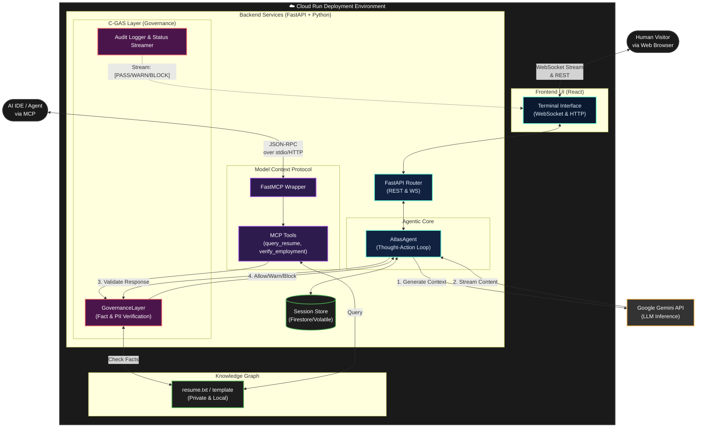

# Atlas-G Protocol Architecture

The Atlas-G Protocol is built on a "Private-by-Design" architecture that allows a high-performance agentic system to interact with public users or AI IDEs while ensuring sensitive background data is strictly governed and never leaked.

### Key Architectural Concepts

**1. Dual Interfacing (Human & Machine)**
The protocol can be interacted with directly via a web browser (React Terminal UI streaming WebSockets) or programmatically via the Model Context Protocol (MCP) by any AI IDE.

**2. Governance Layer (C-GAS 2.0)**
Acts as an interception proxy between the LLM Output and the user. It enforces deterministic rules over probabilistic LLM inputs, validating every claim against the local knowledge graph (`resume.txt`) and striking down jailbreaks, credential probes, and hallucinated facts before they transmit.

**3. Private-by-Design Data Abstraction**
The real capability is driven by an ingestion of local, private files (such as `data/resume.txt`). Public deployments use `resume.template.txt`. No external remote or hardcoded state is strictly required in the open-source release, preventing accidental personal info leakage.
